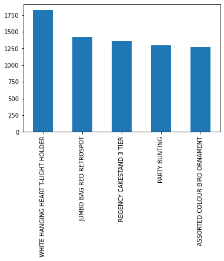
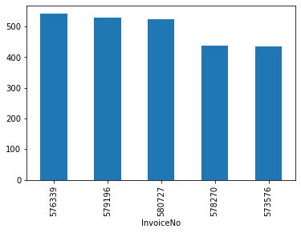
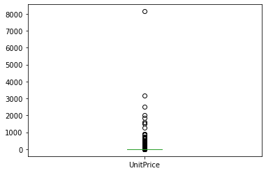
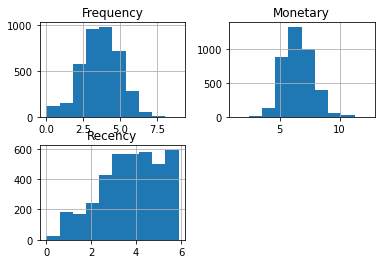
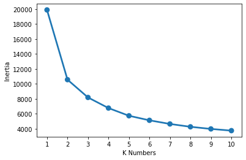
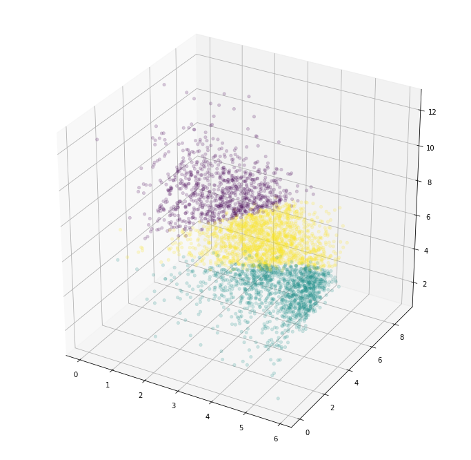

# Customer Segmentation


## Synopsis

Customer segmentation is the process of dividing customers into groups based on common characteristics. This is essential as it allows companies to market to each group effectively and appropriately. By marketing to each customer group differently, companies will be able to maximise their profits. To perform customer segmentation, we will be performing recency, frequency and monetary (RFM) analysis, followed by k-means clustering.

## Data

The data contains various items purchased by various customers across 38 countries. It consists of 541909 rows and 8 columns, which are 'InvoiceNo', 'StockCode', 'Description', 'Quantity', 'InvoiceDate', 'UnitPrice', 'CustomerID' and 'Country'.

## Data Cleaning

Import the required libraries.


```python
import numpy as np
import pandas as pd
import seaborn as sns
import matplotlib.pyplot as plt
import datetime as dt

from sklearn.cluster import KMeans
from mpl_toolkits.mplot3d import Axes3D

%matplotlib inline


```

Read in the input data, display its shape and observe its first few rows.


```python
cus = pd.read_excel("Online Retail.xlsx")
cus.shape
```


    (541909, 8)


```python
cus.head()
```


<div>
<style scoped>
    .dataframe tbody tr th:only-of-type {
        vertical-align: middle;
    }

    .dataframe tbody tr th {
        vertical-align: top;
    }

    .dataframe thead th {
        text-align: right;
    }
</style>
<table border="1" class="dataframe">
  <thead>
    <tr style="text-align: right;">
      <th></th>
      <th>InvoiceNo</th>
      <th>StockCode</th>
      <th>Description</th>
      <th>Quantity</th>
      <th>InvoiceDate</th>
      <th>UnitPrice</th>
      <th>CustomerID</th>
      <th>Country</th>
    </tr>
  </thead>
  <tbody>
    <tr>
      <th>0</th>
      <td>536365</td>
      <td>85123A</td>
      <td>WHITE HANGING HEART T-LIGHT HOLDER</td>
      <td>6</td>
      <td>2010-12-01 08:26:00</td>
      <td>2.55</td>
      <td>17850.0</td>
      <td>United Kingdom</td>
    </tr>
    <tr>
      <th>1</th>
      <td>536365</td>
      <td>71053</td>
      <td>WHITE METAL LANTERN</td>
      <td>6</td>
      <td>2010-12-01 08:26:00</td>
      <td>3.39</td>
      <td>17850.0</td>
      <td>United Kingdom</td>
    </tr>
    <tr>
      <th>2</th>
      <td>536365</td>
      <td>84406B</td>
      <td>CREAM CUPID HEARTS COAT HANGER</td>
      <td>8</td>
      <td>2010-12-01 08:26:00</td>
      <td>2.75</td>
      <td>17850.0</td>
      <td>United Kingdom</td>
    </tr>
    <tr>
      <th>3</th>
      <td>536365</td>
      <td>84029G</td>
      <td>KNITTED UNION FLAG HOT WATER BOTTLE</td>
      <td>6</td>
      <td>2010-12-01 08:26:00</td>
      <td>3.39</td>
      <td>17850.0</td>
      <td>United Kingdom</td>
    </tr>
    <tr>
      <th>4</th>
      <td>536365</td>
      <td>84029E</td>
      <td>RED WOOLLY HOTTIE WHITE HEART.</td>
      <td>6</td>
      <td>2010-12-01 08:26:00</td>
      <td>3.39</td>
      <td>17850.0</td>
      <td>United Kingdom</td>
    </tr>
  </tbody>
</table>
</div>


Check for missing values.


```python
cus.count()
```


    InvoiceNo      541909
    StockCode      541909
    Description    540455
    Quantity       541909
    InvoiceDate    541909
    UnitPrice      541909
    CustomerID     406829
    Country        541909
    dtype: int64


For purpose of analysis, we will only be examining customer purchases from the United Kingdom for 1 year, from 11 December 2010 to 11 December 2011. We also have to remove the null values from 'CustomerID' and 'Description', remove the orders which were cancelled (those with a 'C' in 'InvoiceNo') and remove the negative values from 'Quantity' and 'UnitPrice'.


```python
cus_f = cus[
    (cus['Country']=='United Kingdom') &
    (cus['CustomerID'].notnull()) &
    (cus['Description'].notnull()) &
    (~cus["InvoiceNo"].str.contains("C",na=False)) &
    (cus['Quantity'] > 0) &
    (cus['UnitPrice'] > 0) &
    (cus['InvoiceDate'] >= "2010-12-11") & (cus['InvoiceDate'] < "2011-12-11")
]
```

Check the dimensions of the dataset after filtering.


```python
cus_f.shape
```


    (339702, 8)


Let's change the data types. We first define 'CustomerID' as categorical, but we need to change it to integer first. We also define 'StockCode' as categorical and convert the 'InvoiceDate' to a datetime type.


```python
cus_f['CustomerID'] = pd.Categorical(cus_f['CustomerID'].astype(int))
cus_f['StockCode'] = pd.Categorical(cus_f['StockCode'])
cus_f['InvoiceDate'] = pd.to_datetime(cus_f['InvoiceDate'])
cus_f = cus_f.drop(['Country'], axis=1)
```


## Exploratory Data Analysis

Check the most purchased items.


```python
cus_f['Description'].value_counts().head().plot(kind='bar')
```


    <matplotlib.axes._subplots.AxesSubplot at 0x7fac7deab310>





Determine which invoice has most number of unique items.


```python
most_unique = cus_f.groupby('InvoiceNo')['Description'].nunique().sort_values(ascending = False)
most_unique.head().plot(kind='bar')
```


    <matplotlib.axes._subplots.AxesSubplot at 0x7fac69100e80>





Determine the distribution of unit price.


```python
cus_f['UnitPrice'].plot(kind='box')
```


    <matplotlib.axes._subplots.AxesSubplot at 0x7fac6b2fd4f0>





## Feature Engineering

The following 2 columns will be created:

- **InvoiceDay** - Day of the invoice

- **TotalSum** - Total amount customer purchased for a particular item


```python
cus_f['InvoiceDay'] = cus_f.InvoiceDate.apply(lambda x: dt.datetime(x.year, x.month, x.day))
ref_date = max(cus_f.InvoiceDay) + dt.timedelta(1)
cus_f['TotalSum'] = cus_f.Quantity * cus_f.UnitPrice
```

## Recency, Frequency, Monetary (RFM)

The following are the details of RFM analysis:

- **Recency** - The amount of time since last purchase

- **Frequency** - The total number of orders

- **Monetary** - The total amount spent

Calculate RFM values for each customer.


```python
rfm = cus_f.groupby('CustomerID').agg({
     'InvoiceNo':'count',
     'TotalSum':'sum',
     'InvoiceDay': lambda x: ref_date - x.max()})
```

Rename the columns.


```python
rfm.rename(columns={
     'InvoiceNo':'Frequency',
     'TotalSum':'Monetary',
     'InvoiceDay':'Recency'
 }, inplace=True)
```

Convert 'Recency' column to numerical.


```python
rfm['Recency'] = rfm['Recency'].dt.days
```


```python
rfm
```


<div>
<style scoped>
    .dataframe tbody tr th:only-of-type {
        vertical-align: middle;
    }

    .dataframe tbody tr th {
        vertical-align: top;
    }

    .dataframe thead th {
        text-align: right;
    }
</style>
<table border="1" class="dataframe">
  <thead>
    <tr style="text-align: right;">
      <th></th>
      <th>Frequency</th>
      <th>Monetary</th>
      <th>Recency</th>
    </tr>
    <tr>
      <th>CustomerID</th>
      <th></th>
      <th></th>
      <th></th>
    </tr>
  </thead>
  <tbody>
    <tr>
      <th>12346</th>
      <td>1</td>
      <td>77183.60</td>
      <td>326</td>
    </tr>
    <tr>
      <th>12747</th>
      <td>96</td>
      <td>3837.45</td>
      <td>3</td>
    </tr>
    <tr>
      <th>12748</th>
      <td>4051</td>
      <td>30301.40</td>
      <td>1</td>
    </tr>
    <tr>
      <th>12749</th>
      <td>199</td>
      <td>4090.88</td>
      <td>4</td>
    </tr>
    <tr>
      <th>12820</th>
      <td>59</td>
      <td>942.34</td>
      <td>4</td>
    </tr>
    <tr>
      <th>...</th>
      <td>...</td>
      <td>...</td>
      <td>...</td>
    </tr>
    <tr>
      <th>18280</th>
      <td>10</td>
      <td>180.60</td>
      <td>278</td>
    </tr>
    <tr>
      <th>18281</th>
      <td>7</td>
      <td>80.82</td>
      <td>181</td>
    </tr>
    <tr>
      <th>18282</th>
      <td>12</td>
      <td>178.05</td>
      <td>8</td>
    </tr>
    <tr>
      <th>18283</th>
      <td>756</td>
      <td>2094.88</td>
      <td>4</td>
    </tr>
    <tr>
      <th>18287</th>
      <td>70</td>
      <td>1837.28</td>
      <td>43</td>
    </tr>
  </tbody>
</table>
<p>3849 rows × 3 columns</p>
</div>


Apply log transformation to check the distributions of recency, frequency and monetary.


```python
rfm_log = rfm[['Recency', 'Frequency', 'Monetary']].apply(np.log, axis = 1)
rfm_log.hist()
plt.show()
```





## Modelling

K-means clustering will be used to cluster the data. The algorithm is as follows:

**Step 1** - Select a suitable number of groups, k

**Step 2** - Randomly select k distinct data points, which will be called cluster centroids

**Step 3** - Assign every data point to the closest cluster centroid

**Step 4** - Move the cluster centroid to the average of the points in a cluster

**Step 5** - Repeat Steps 3 and 4 until there are no changes in the clusters

First, we need to determine a suitable value of k by creating a elbow plot.


```python
inertia = {}
for k in range(1,11):
    mod = KMeans(n_clusters=k)
    mod.fit(rfm_log)
    inertia[k] = mod.inertia_

sns.pointplot(x = list(inertia.keys()), y = list(inertia.values()))
plt.xlabel('K Numbers')
plt.ylabel('Inertia')
plt.show()
```





We select k=3 and build the model using k-means clustering with 3 clusters.


```python
model = KMeans(n_clusters=3, random_state = 42)
model.fit(rfm_log)
rfm_log['cluster'] = model.predict(rfm_log)
rfm_log.head()
```


<div>
<style scoped>
    .dataframe tbody tr th:only-of-type {
        vertical-align: middle;
    }

    .dataframe tbody tr th {
        vertical-align: top;
    }

    .dataframe thead th {
        text-align: right;
    }
</style>
<table border="1" class="dataframe">
  <thead>
    <tr style="text-align: right;">
      <th></th>
      <th>Recency</th>
      <th>Frequency</th>
      <th>Monetary</th>
      <th>cluster</th>
    </tr>
    <tr>
      <th>CustomerID</th>
      <th></th>
      <th></th>
      <th></th>
      <th></th>
    </tr>
  </thead>
  <tbody>
    <tr>
      <th>12346</th>
      <td>5.786897</td>
      <td>0.000000</td>
      <td>11.253942</td>
      <td>2</td>
    </tr>
    <tr>
      <th>12747</th>
      <td>1.098612</td>
      <td>4.564348</td>
      <td>8.252563</td>
      <td>0</td>
    </tr>
    <tr>
      <th>12748</th>
      <td>0.000000</td>
      <td>8.306719</td>
      <td>10.318949</td>
      <td>0</td>
    </tr>
    <tr>
      <th>12749</th>
      <td>1.386294</td>
      <td>5.293305</td>
      <td>8.316515</td>
      <td>0</td>
    </tr>
    <tr>
      <th>12820</th>
      <td>1.386294</td>
      <td>4.077537</td>
      <td>6.848366</td>
      <td>0</td>
    </tr>
  </tbody>
</table>
</div>


Plot a 3D scatterplot to observe the clusters.


```python
from mpl_toolkits.mplot3d import Axes3D
fig=plt.figure(figsize=(12,12))
ax = plt.axes(projection='3d')
ax.scatter(rfm_log.Recency, rfm_log.Frequency, 
                        rfm_log.Monetary, c=rfm_log.cluster,
                        cmap='viridis', linewidth=0.5, alpha=0.2);
plt.show()
```





Let's compare the centroid values.


```python
centroids_log = pd.DataFrame(model.cluster_centers_, columns=['Recency', 'Frequency', 'Monetary'])
centroids_log
```


<div>
<style scoped>
    .dataframe tbody tr th:only-of-type {
        vertical-align: middle;
    }

    .dataframe tbody tr th {
        vertical-align: top;
    }

    .dataframe thead th {
        text-align: right;
    }
</style>
<table border="1" class="dataframe">
  <thead>
    <tr style="text-align: right;">
      <th></th>
      <th>Recency</th>
      <th>Frequency</th>
      <th>Monetary</th>
    </tr>
  </thead>
  <tbody>
    <tr>
      <th>0</th>
      <td>2.064102</td>
      <td>5.082637</td>
      <td>7.948802</td>
    </tr>
    <tr>
      <th>1</th>
      <td>4.791228</td>
      <td>2.337495</td>
      <td>5.396649</td>
    </tr>
    <tr>
      <th>2</th>
      <td>3.822030</td>
      <td>3.949997</td>
      <td>6.695534</td>
    </tr>
  </tbody>
</table>
</div>


Convert these centroid values back to the original scale.


```python
centroids_orig = centroids_log.apply(np.exp, axis = 1).round(3)
centroids_orig
```


<div>
<style scoped>
    .dataframe tbody tr th:only-of-type {
        vertical-align: middle;
    }

    .dataframe tbody tr th {
        vertical-align: top;
    }

    .dataframe thead th {
        text-align: right;
    }
</style>
<table border="1" class="dataframe">
  <thead>
    <tr style="text-align: right;">
      <th></th>
      <th>Recency</th>
      <th>Frequency</th>
      <th>Monetary</th>
    </tr>
  </thead>
  <tbody>
    <tr>
      <th>0</th>
      <td>7.878</td>
      <td>161.199</td>
      <td>2832.180</td>
    </tr>
    <tr>
      <th>1</th>
      <td>120.449</td>
      <td>10.355</td>
      <td>220.666</td>
    </tr>
    <tr>
      <th>2</th>
      <td>45.697</td>
      <td>51.935</td>
      <td>808.786</td>
    </tr>
  </tbody>
</table>
</div>


## Extracting the clusters

Let's obtain the small spending customers (high recency, low frequency, low monetary) and large spending customers (low recency, high frequency, high monetary).


```python
small_customers = rfm_log[rfm_log.cluster == 1]
                         
small_customers = small_customers[['Recency', 'Frequency', 'Monetary']].apply(np.exp, axis = 1)
small_customers['Recency'] = np.rint(small_customers['Recency']).astype(int)
small_customers['Frequency'] = np.rint(small_customers['Frequency']).astype(int)
small_customers['Monetary'] = np.round(small_customers['Monetary'], 2)
```


```python
small_customers
```


<div>
<style scoped>
    .dataframe tbody tr th:only-of-type {
        vertical-align: middle;
    }

    .dataframe tbody tr th {
        vertical-align: top;
    }

    .dataframe thead th {
        text-align: right;
    }
</style>
<table border="1" class="dataframe">
  <thead>
    <tr style="text-align: right;">
      <th></th>
      <th>Recency</th>
      <th>Frequency</th>
      <th>Monetary</th>
    </tr>
    <tr>
      <th>CustomerID</th>
      <th></th>
      <th></th>
      <th></th>
    </tr>
  </thead>
  <tbody>
    <tr>
      <th>12821</th>
      <td>215</td>
      <td>6</td>
      <td>92.72</td>
    </tr>
    <tr>
      <th>12823</th>
      <td>75</td>
      <td>5</td>
      <td>1759.50</td>
    </tr>
    <tr>
      <th>12829</th>
      <td>337</td>
      <td>11</td>
      <td>293.00</td>
    </tr>
    <tr>
      <th>12831</th>
      <td>263</td>
      <td>9</td>
      <td>215.05</td>
    </tr>
    <tr>
      <th>12833</th>
      <td>146</td>
      <td>24</td>
      <td>417.38</td>
    </tr>
    <tr>
      <th>...</th>
      <td>...</td>
      <td>...</td>
      <td>...</td>
    </tr>
    <tr>
      <th>18277</th>
      <td>59</td>
      <td>8</td>
      <td>110.38</td>
    </tr>
    <tr>
      <th>18278</th>
      <td>74</td>
      <td>9</td>
      <td>173.90</td>
    </tr>
    <tr>
      <th>18280</th>
      <td>278</td>
      <td>10</td>
      <td>180.60</td>
    </tr>
    <tr>
      <th>18281</th>
      <td>181</td>
      <td>7</td>
      <td>80.82</td>
    </tr>
    <tr>
      <th>18282</th>
      <td>8</td>
      <td>12</td>
      <td>178.05</td>
    </tr>
  </tbody>
</table>
<p>1330 rows × 3 columns</p>
</div>


```python
large_customers = rfm_log[rfm_log.cluster == 0]

large_customers = large_customers[['Recency', 'Frequency', 'Monetary']].apply(np.exp, axis = 1)
large_customers['Recency'] = np.rint(large_customers['Recency']).astype(int)
large_customers['Frequency'] = np.rint(large_customers['Frequency']).astype(int)
large_customers['Monetary'] = np.round(large_customers['Monetary'], 2)
```


```python
large_customers
```


<div>
<style scoped>
    .dataframe tbody tr th:only-of-type {
        vertical-align: middle;
    }

    .dataframe tbody tr th {
        vertical-align: top;
    }

    .dataframe thead th {
        text-align: right;
    }
</style>
<table border="1" class="dataframe">
  <thead>
    <tr style="text-align: right;">
      <th></th>
      <th>Recency</th>
      <th>Frequency</th>
      <th>Monetary</th>
    </tr>
    <tr>
      <th>CustomerID</th>
      <th></th>
      <th></th>
      <th></th>
    </tr>
  </thead>
  <tbody>
    <tr>
      <th>12747</th>
      <td>3</td>
      <td>96</td>
      <td>3837.45</td>
    </tr>
    <tr>
      <th>12748</th>
      <td>1</td>
      <td>4051</td>
      <td>30301.40</td>
    </tr>
    <tr>
      <th>12749</th>
      <td>4</td>
      <td>199</td>
      <td>4090.88</td>
    </tr>
    <tr>
      <th>12820</th>
      <td>4</td>
      <td>59</td>
      <td>942.34</td>
    </tr>
    <tr>
      <th>12826</th>
      <td>3</td>
      <td>82</td>
      <td>1319.72</td>
    </tr>
    <tr>
      <th>...</th>
      <td>...</td>
      <td>...</td>
      <td>...</td>
    </tr>
    <tr>
      <th>18237</th>
      <td>3</td>
      <td>61</td>
      <td>987.10</td>
    </tr>
    <tr>
      <th>18241</th>
      <td>10</td>
      <td>104</td>
      <td>2073.09</td>
    </tr>
    <tr>
      <th>18245</th>
      <td>8</td>
      <td>175</td>
      <td>2567.06</td>
    </tr>
    <tr>
      <th>18272</th>
      <td>3</td>
      <td>166</td>
      <td>3078.58</td>
    </tr>
    <tr>
      <th>18283</th>
      <td>4</td>
      <td>756</td>
      <td>2094.88</td>
    </tr>
  </tbody>
</table>
<p>875 rows × 3 columns</p>
</div>


